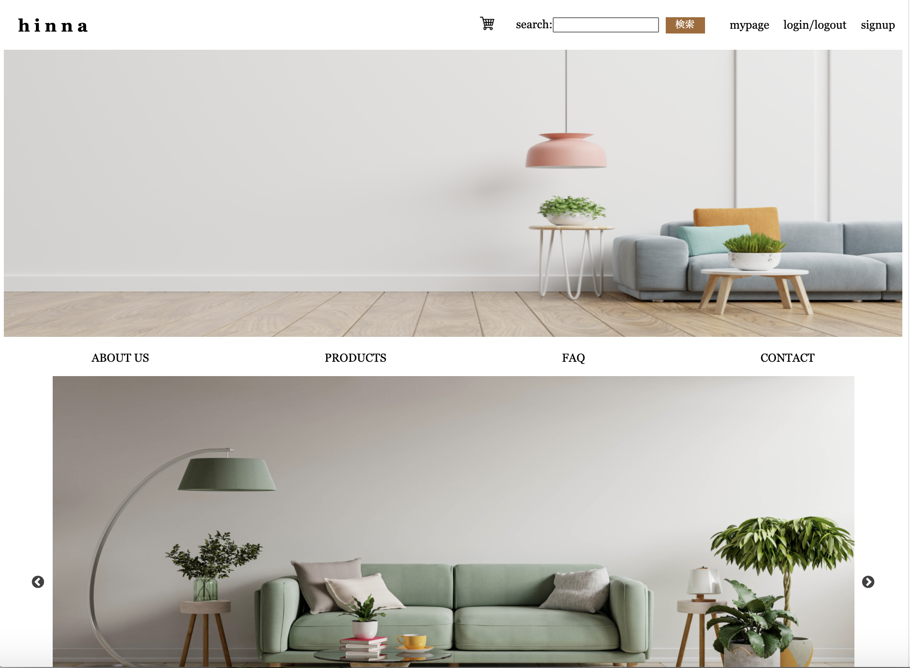
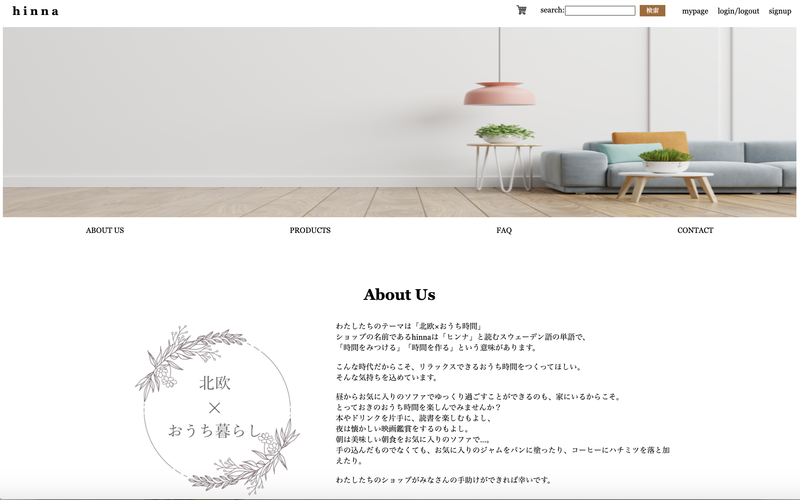
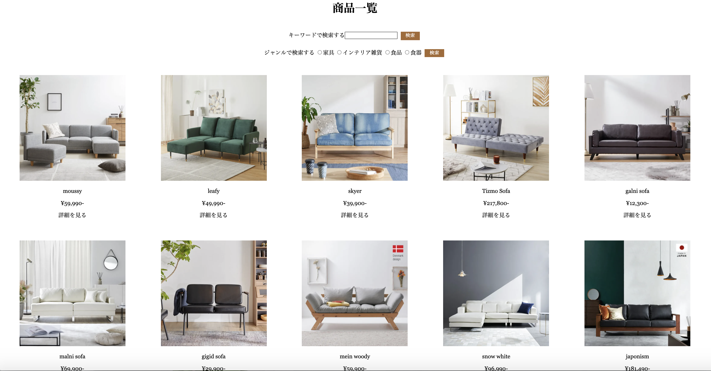
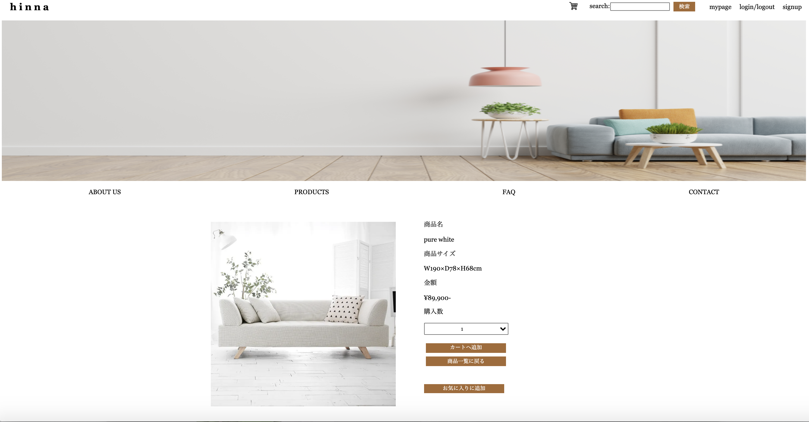
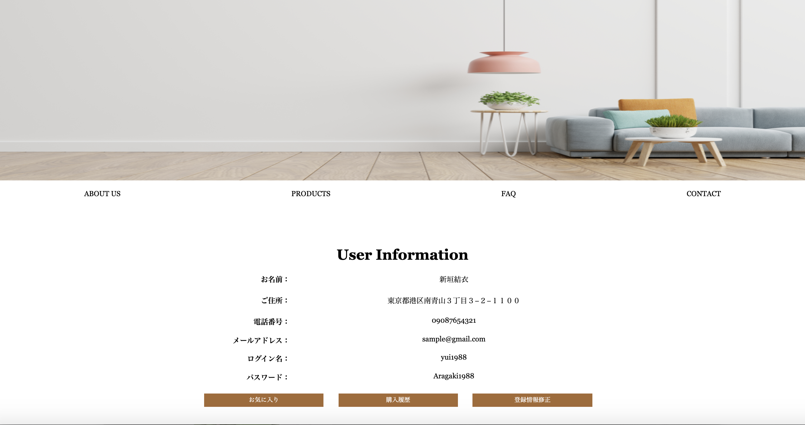
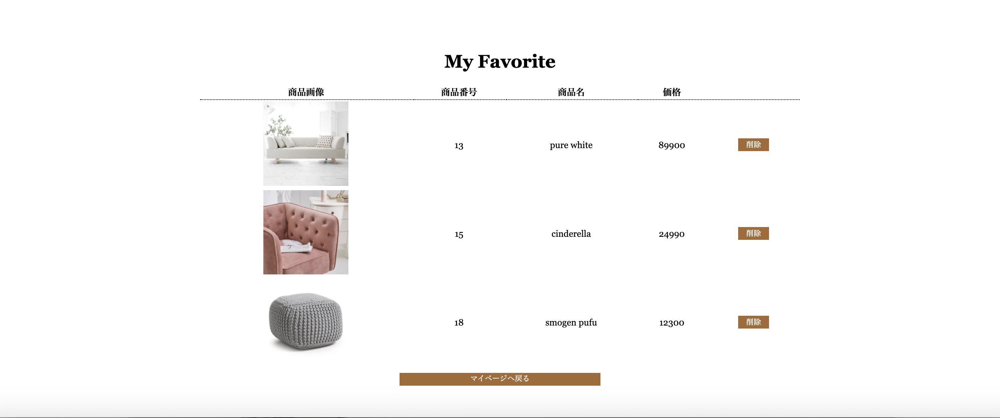

# hinna

# Description

このアプリは、インテックス IT ナレッジの職業訓練中に、開発演習をおこなった成果物です

演習課題：「架空のショップの販売サイトをつくる」

制作期間：60 時間

制作人数：4 名

コンセプト：南青山の路面店にある、少し高級思考の北欧家具、雑貨輸入専門店

想定のターゲット層：２０代後半〜４０代の女性

# Usage

# Requirement

### 環境構築

MAMP

PHP

JavaScript

jQuery

# Installation

Mac の場合
[MAMP のインストール](https://www.mamp.info/en/windows/)

Windows の場合
[ZAMPP のインストール](https://www.apachefriends.org/jp/download.html)

# Note

- ネットワークのない環境での動作保証はありません.

# Author

Saeka Isozumi

saeka.isozumi@gmail.com

# License

MIT © [SaekaIsozumi](https://github.com/SaekaIsozumi01).
